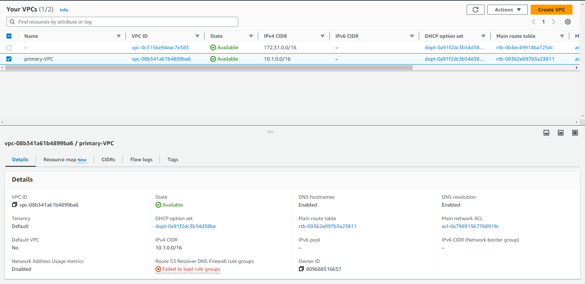
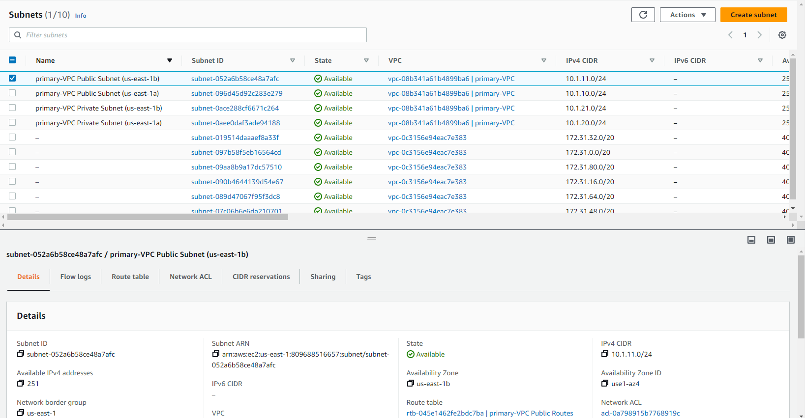
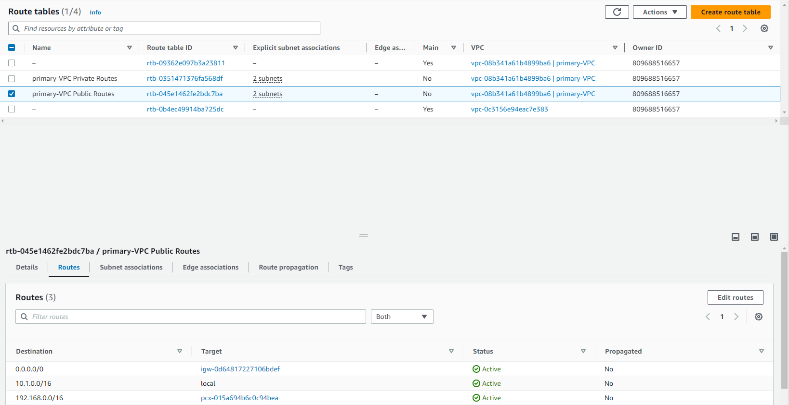
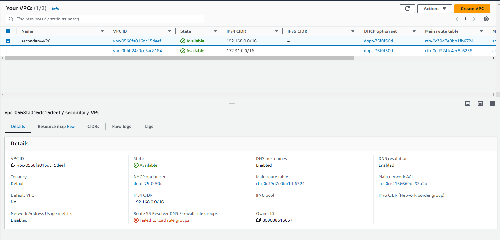
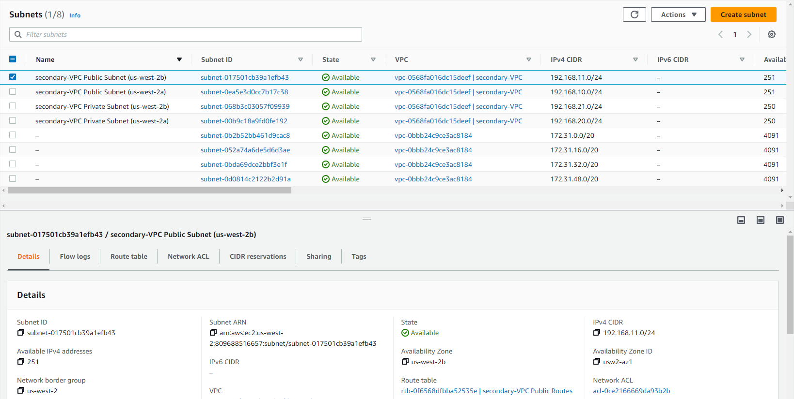
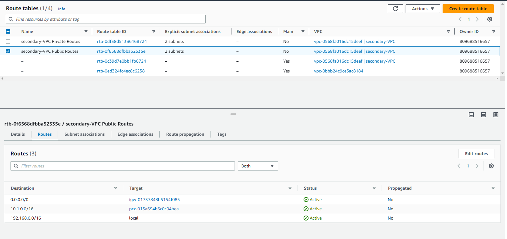

# AWS Cloud
> AWS cloud projects

## Table of Contents
* [Project 1](#project-1)

## Project 1
Create staging tables and analyzing tables in Redshift, drop all tables if they are existed
$ python create_tables.py 

### VPC setup
Run ./cloudformation/vpc/yaml
#### primary-VPC (us-east-1)

#### secondary-VPC (us-west-2)

