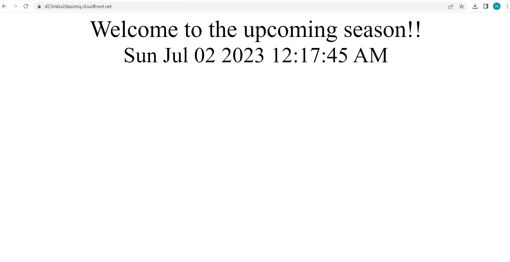

# AWS Cloud
> AWS cloud projects

## Table of Contents
* [Project 1](#project-1)

## Project 1
* [Part 1: Data Durability And Recovery](#part-1:-data-durability-and-recovery)
* [Part 2: Failover And Recovery](#part-2:-Failover-and-recovery)
* [Part 3: Web Resiliency](#part-3:-web-resiliency)

### Part 1: Data Durability And Recovery

#### Primary-VPC
Run ./cloudformation/vpc.yaml in region us-east-1

 
#### Secondary-VPC
Run ./cloudformation/vpc.yaml in regions us-west-2

 
#### Primary RDS setup
run ./cloudformation/rds_primary.yaml

 
#### Primary RDS setup
run ./cloudformation/rds_secondary.yaml

 
#### Availability Estimate
[estimates](logs/estimates.txt)
 
#### Primary RDS usage
[log_primary](logs/log_primary.txt)
 
#### Monitor database
Observe the “DB Connections” to the database and how this metric changes as you connect to the database

Observe the “Replication” configuration

 
 
### Part 2: Failover And Recovery

#### secondaryDB before promotion
[log_rr_before_promotion](logs/log_rr_before_promotion.txt)

 
#### secondaryDB after promotion
[log_rr_after_promotion](logs/log_rr_after_promotion.txt)

 
 
### Part 3: Web Resiliency
First of all, upload files under ./s3 folder into aws s3 and setup cloudfront

Case 1 : Build a resilient static web hosting solution in AWS. Create a versioned S3 bucket and configure it as a static website.

 

Case 2 : “accidentally” change the contents of the website such that it is no longer serving the correct content

 

Case 3 : “recover” the website by rolling the content back to a previous

 

Case 4 : You will now “accidentally” delete contents from the S3 bucket. Delete “winter.jpg”

 

Case 5 :“recover” winter.jpg object

