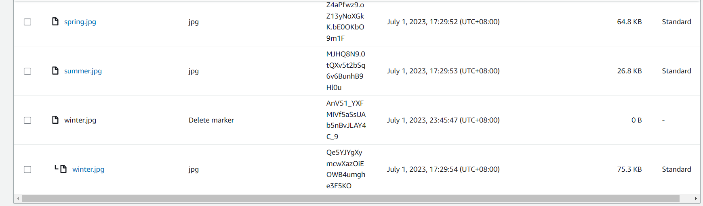

# AWS Cloud
> AWS cloud projects

## Table of Contents
* [Project 1](#project-1)

## Project 1
Create staging tables and analyzing tables in Redshift, drop all tables if they are existed
$ python create_tables.py 

### Part 1: Data Durability And Recovery

#### Primary-VPC
Run ./cloudformation/vpc.yaml in region us-east-1

#### Secondary-VPC
Run ./cloudformation/vpc.yaml in regions us-west-2

### Primary RDS setup
run ./cloudformation/rds_primary.yaml

### Primary RDS setup
run ./cloudformation/rds_secondary.yaml

### Primary RDS usage

[log_primary](logs/log_primary.txt)

### Monitor database
Observe the “DB Connections” to the database and how this metric changes as you connect to the database

Observe the “Replication” configuration

### Part 2: Failover And Recovery

#### secondaryDB before promotion
[log_rr_before_promotion](logs/log_rr_before_promotion.txt)

#### secondaryDB after promotion
[log_rr_after_promotion](logs/log_rr_after_promotion.txt)

### Part 3: Web Resiliency
First of all, upload files under ./s3 folder into aws s3 and setup cloudfront

Build a resilient static web hosting solution in AWS. Create a versioned S3 bucket and configure it as a static website.

“accidentally” change the contents of the website such that it is no longer serving the correct content

“recover” the website by rolling the content back to a previous

You will now “accidentally” delete contents from the S3 bucket. Delete “winter.jpg”

“recover” winter.jpg object

