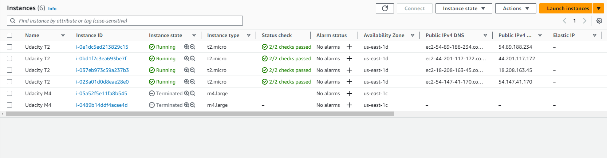

# AWS Cloud
> AWS cloud projects

## Table of Contents
* [Project 2](#project-2)

## Project 2
* [Task 1: Create AWS Architecture Schematics](#Task-1--Create-AWS-Architecture-Schematics)
* [Task 2: Calculate Infrastructure Costs](#Task-2--Calculate-Infrastructure-Costs)
* [Task 3: Configure Permissions](#Task-3--Configure-Permissions)
* [Task 4: Set up Cost Monitoring](#Task-4--Setup-Cost-Monitoring)
* [Task 5: Use Terraform to Provision AWS Infrastructure](#Task-5--Use-Terraform-to-Provision-AWS-Infrastructure)
* [Task 6: Destroy the Infrastructure using Terraform and prepare for submission](#Task-6--Destroy-the-Infrastructure-using-Terraform-and-prepare-for-submission)

### Task 1: Create AWS Architecture Schematics

#### Part 1
You have been asked to plan and provision a cost-effective AWS infrastructure for a new social media application development project for 50,000 single-region users. The project requires the following AWS infrastructure and services. Please include your name and label all elements of the infrastructure on the diagram.

[Udacity_Diagram_1](./diagrams/Udacity_Diagram_1.pdf)

 

#### Part 2
You have been asked to plan a SERVERLESS architecture schematic for a new application development project. The project requires the following AWS infrastructure and services.

[Udacity_Diagram_1](./diagrams/Udacity_Diagram_1.pdf)

 
 

### Task 2: Calculate Infrastructure Costs

Use the AWS Pricing Calculator to estimate how much it will cost to run the services in your Part 1 diagram for one month.

#### Budget in between $8,000-$10,000
[Initial_Cost_Estimate](Initial_Cost_Estimate.txt)
 

#### Budget is reduced to maximum of $6,500
When the budget is reduced, we prioterize to keep main resources such as EC2 , database ... to granrantee server is still able to handle same number of requests as before. Therefore, we can give up some capacity of storages or cloudfront edge cache, this can effect response time.

[Reduced_Cost_Estimate](Reduced_Cost_Estimate.txt)
 

#### Budget has been increased to $20,000
When the budge is increased, we can scale up or out EC2 , RDS to increase hanlding number of user requests per second. Moreover, we might consider to expand Cloudfront cache at edge locations, improve Application Load Balancer ability matching to high number of incomming requests , also buy more capacity of storages to save more user data and backup 

[Increased_Cost_Estimate](Increased_Cost_Estimate.txt)

 
 

### Task 3: Configure Permissions
[UdacityCloudTrailLog](UdacityCloudTrailLog.csv)
 
 

 
 
### Task 4: Set up Cost Monitoring

 
 
### Task 5: Use Terraform to Provision AWS Infrastructure

#### Part 1

 
#### Part 2

 
 
### Task 6: Destroy the Infrastructure using Terraform and prepare for submission

